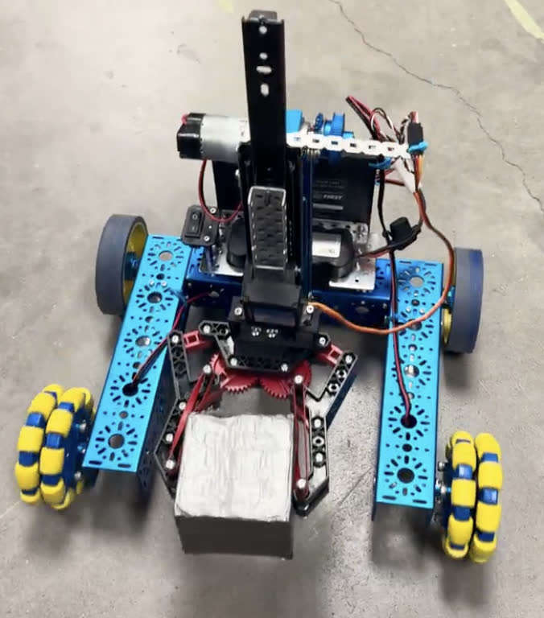
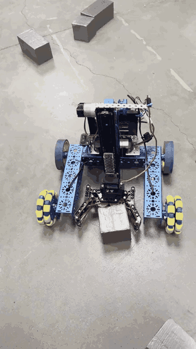

# OntarioSkills Competition Robot

> Think of a warehouse worker, but made of metal, wires, and code.

A competition robot with a motorised claw built to lift, carry and drop boxes while navigating a set course.
**Placed 5th provincially at Skills Ontario**, and 2nd at Peel Skills.



### Demo



<sub>Full-quality video: [`media/demo.mp4`](media/demo.mp4) — GitHub can't play committed MP4s inline, so the GIF above is the preview.</sub>

---

## Credit where it's due

This was a **team project** with the Castlebrooke Robotics Team. I worked on the drivetrain and the control
logic, and served as admin lead for the team's documentation and testing workflow. The mechanical build was
a group effort. This repo covers the software side, which is the part I owned.

## The problem

The course required the robot to approach a target, grab a box, carry it without dropping or tipping, and
release it at a destination — repeatedly, under time pressure, with judges watching. Reliability mattered
far more than speed. A fast robot that drops one box in three loses to a slower one that never drops any.

## How it works

The drivetrain is a standard differential pair through an L298N. The claw and lift are both servos, driven
through a `sweep()` helper rather than direct `write()` calls so neither one snaps to position.

The interesting part is the **order of operations in `grab()`**:

```
close the claw  →  wait GRIP_SETTLE_MS  →  then lift
```

That `delay` is the entire fix for the biggest problem we had. See below.

There's also a `carrying` flag that drops the drive speed while a box is in the claw, which is the software
half of the tipping fix.

## Hardware

| Part | Notes |
|---|---|
| Arduino Uno | |
| L298N dual H-bridge | drivetrain |
| 2 × DC gear motors | differential drive |
| 2 × servos | claw grip, arm lift |
| Reinforced chassis | see below — this was a fix, not the original design |
| Battery pack | separate supply for motors |

## What went wrong

**Early on, the claw was basically a butterfingers — it kept dropping boxes mid-lift.** The claw would close,
the arm would start lifting, and the box would slip out. Two things caused it: the grip angle wasn't tight
enough to hold under the acceleration of the lift, and the lift began before the claw had fully settled on
the box. Adjusting grip strength *and* timing in the code fixed it, which is why `GRIP_CLOSED` and
`GRIP_SETTLE_MS` are both called out as named constants — they're the two numbers that made this robot
work.

**Weight distribution.** When the claw lifted heavier loads, the whole robot tilted forward like it was
about to face-plant. Reinforcing the chassis and tweaking motor power fixed that — mechanically by
stiffening the frame, and in software by capping drive speed while carrying so acceleration doesn't add to
the forward moment.

**The real lesson:** mechanical design and programming have to be solved together. Code alone won't save you
if the build can't handle it. We spent a while trying to fix a structural tipping problem in software before
accepting that the chassis needed to change.

By the end we had a reliable bot that could grab, lift and move boxes like it was born to work in logistics.

## What I'd do differently

- **Add encoders.** Everything here runs on timed movements, which means battery voltage changes how far the
  robot travels. Encoder-based distance would remove a whole category of drift.
- **Sensor-based alignment instead of dead reckoning.** We aligned by timing; a line sensor or distance
  sensor to square up against the target would be far more repeatable under competition conditions.
- **Current-sense the claw** so grip strength adapts to the object instead of being a fixed angle tuned for
  one box size.

## A note on this code

This is a reconstruction. The team's original program was not mine to keep and I no longer have it — what's
here is the control logic as I worked on it, rebuilt to match the robot's real behaviour, including the two
fixes above that are the reason it stopped dropping boxes.

## License

MIT — see [LICENSE](LICENSE).
